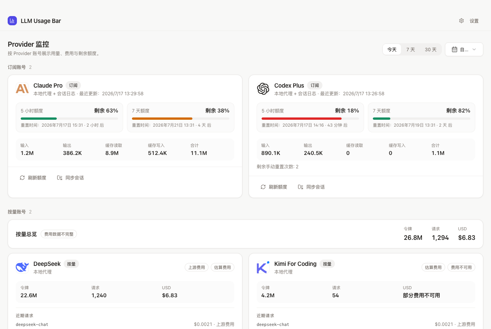
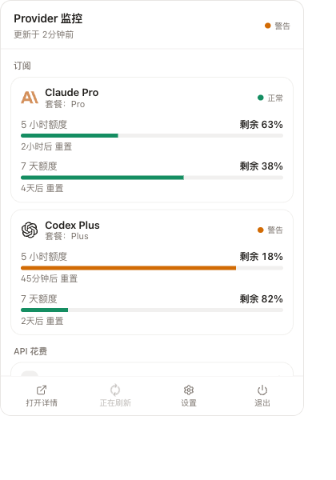

<div align="center">

# LLM Usage Bar

### 你的 AI 程式設計工具到底花了多少 —— 訂閱額度和 API 花費，都在選單欄裡

[](#安裝)
[](https://tauri.app/)
[](LICENSE)

[English](README.md) | [简体中文](README_ZH.md) | 繁體中文 | [更新日誌](CHANGELOG.md)

_Fork 自 [CC Switch](https://github.com/farion1231/cc-switch)，圍繞用量追蹤重建 —— 見 [致謝](#致謝)。_

</div>

## 介面預覽

這套 React + Tauri 介面同時面向 macOS 和 Windows。下面使用淺色主題展示幾個主要流程：

<table>
  <tr>
    <td width="62%"></td>
    <td width="38%"><strong>主面板</strong><br />在一個頁面查看訂閱視窗、API 花費、token 總量、請求次數和各 Provider 狀態。</td>
  </tr>
  <tr>
    <td width="62%"></td>
    <td width="38%"><strong>Provider 設定</strong><br />選擇預設、填寫 API key、檢查端點地址，並配置 Codex 所需的模型和路由選項。</td>
  </tr>
  <tr>
    <td width="62%"></td>
    <td width="38%"><strong>本地路由</strong><br />啟用 Codex 路由，選擇要接管的客戶端，查看本地服務地址並確認連線狀態。</td>
  </tr>
  <tr>
    <td width="38%"></td>
    <td width="62%"><strong>系統匣</strong><br />無需打開完整面板，就能快速查看額度健康度和重置時間。</td>
  </tr>
</table>

## 它做什麼

同時用 Claude Code 和 Codex 的話，用量是散在幾個永遠對不上的地方的：Claude 訂閱有五小時視窗和每週視窗，Codex 有自己的 OAuth 額度，另外還有一堆按 token 計費的 API key。每個都有自己的頁面、自己的重置時鐘，沒有一個共同的總數。

LLM Usage Bar 在本地把這些全讀出來，在選單欄給出一個答案：**還剩多少，以及你消耗得有多快。**

監控功能讀取工具寫入本地的會話日誌和額度檔案，並用你提供的 key 查詢供應商帳單。可選的本地路由在設定中單獨配置，只有明確確認「連線 Codex」才會修改 CLI 配置。

## 它跟蹤兩類東西

**訂閱額度** —— 你已經付過錢的那些按百分比計的視窗。

- **Claude** —— 五小時和每週兩個視窗，來自 Claude Desktop 的本地套餐歷史和 Claude Code 的狀態列橋接。重置時刻會被鎖存，因此不管哪個資料來源最後重新整理它都不會丟，並且始終繫結在提供它的那個帳號上。
- **Codex** —— 用你已有的 OAuth 會話查詢額度。
- **Coding Plan** —— Kimi For Coding、智譜 GLM（個人版與團隊版）、MiniMax、火山方舟。帶用量重置次數的套餐會顯示還剩幾次以及各自的過期時間。

**API 花費** —— 真金白銀，按 key 算。

- 給一個 Provider 配置一列**具名 API key**，每把 key 各自報告自己的日花費、月花費、剩餘預算，以及數字是什麼時候抓取的。有兩把以上 key 的 Provider 還會顯示合計。
- 花費來自供應商自己的帳單介面。目前接好的是 OpenRouter；其他預設需要先接上各自的介面才會有數字。
- 可以給單個 Provider 設日預算，也可以設一個總的 API 預算，超速了選單欄會告訴你。

## 可選的 Codex 本地路由

設定 → 本地路由提供供應商優先順序、已儲存的 API key 選擇、模型對映、自動故障切換或手動指定供應商，以及請求/token 分帳。連線前需配置支援 Responses 的介面及模型對映；連線操作經過確認並備份配置。「恢復直連」保留當前其他 Codex 設定。連線和恢復後都需重啟 Codex，路由使用期間保持應用執行。分帳僅統計實際觀察到的用量，是下界，並非帳戶餘額。

## 用量紅綠燈

選單欄只給一個指示，而不是丟給你一個要自己解讀的數字。它把當前的燃燒速度投影到重置時鐘剩下的時間上：

- **健康** —— 按這個速度，視窗結束時還有富餘
- **警告** —— 按這個速度，會在重置前用完
- **危急** —— 已經越過那個點了

開啟彈窗能看到判斷依據：實測的速度、投影的結果、以及距離視窗翻篇還有多久。

## 數字從哪來

| 來源                         | 提供什麼                    | 怎麼拿到的                                           |
| ---------------------------- | --------------------------- | ---------------------------------------------------- |
| Claude Code / Codex 會話日誌 | token、模型、每次請求的成本 | 從 CLI 本地寫的 JSONL 檔案匯入                       |
| Claude Desktop 套餐歷史      | 五小時和每週的百分比        | 本地 JSON，由該 app 自己重新整理                     |
| Claude Code 狀態列           | 百分比**以及**重置時刻      | 本地快取，在會話渲染狀態列時寫入                     |
| Codex OAuth                  | 訂閱額度                    | 用你已有的 OAuth 會話簽名請求                        |
| Coding Plan 介面             | 套餐額度與剩餘重置次數      | Kimi、GLM、MiniMax 用 API key；火山方舟用 AK/SK 簽名 |
| 供應商帳單介面               | 每把 key 的花費與額度上限   | 用你儲存的 key 直接呼叫                              |

沒有本地代理，也不攔截任何請求。工具沒寫到磁碟上、介面也不報告的東西，這個 app 就是不知道。

## 分類檢視

三個 Tab 共用同一個時間範圍 —— 今天、7 天、30 天或一年：

- **Providers** —— 每個 Provider 的花費與 token，配 12 個月的每日活躍熱力圖和按小時/按天的趨勢圖
- **Models** —— 錢到底花在哪些模型上
- **Agents** —— 是哪個工具花的；可以顯式繫結 Agent 與 Provider，處理那些否則無法歸屬的流量

每一次請求都可以展開檢視，成本按你掌控的定價重算：可以重新整理官方價目表，也可以為任一模型在某個 Provider 下單獨覆蓋價格。

## 跨平臺技術棧

正式技術路線為 **React + TypeScript 前端、Tauri 2 + Rust 後端**，macOS 和 Windows 共用同一套介面與業務邏輯。已停止 Swift / SwiftUI 遷移路線；歷史分支僅作歸檔。macOS 使用選單欄，Windows 使用系統托盤。

構建需要 Node.js 24 LTS、pnpm 11 和 Rust stable。macOS 需 Xcode Command Line Tools；Windows 10/11 需 Visual Studio C++ Build Tools（含 Windows SDK）及 WebView2。

```sh
pnpm install --frozen-lockfile
pnpm dev
# 在目標系統上生成安裝包
pnpm build
```

macOS 生成 app / DMG，Windows 生成 NSIS / MSI；產物在 `release/tauri-target/release/bundle/`。Windows CI 驗證編譯、憑據儲存和路由連線/恢復；釋出構建還會安裝 NSIS 包，檢查應用啟動、資料庫初始化與本地路由。Windows 托盤互動仍需人工驗證。

API key 在 macOS 存入 Keychain，在 Windows 存入當前使用者的 Credential Manager。macOS 除錯構建仍禁用憑據儲存。Claude Desktop 本地資料來源具有平臺差異，Windows 不保證與 macOS 完全一致。

## 安裝

從 [GitHub Releases](https://github.com/Xr810/LLM-Usage-Bar/releases/latest) 下載 macOS / Windows 安裝包。macOS 使用臨時簽名，未經 Apple 公證；Windows 安裝包未簽名。安裝說明和 SHA-256 校驗值見 release 頁面。也可按上面的跨平臺命令自行構建。macOS 12 及以上也可使用帶簽名的本地構建指令碼：

```bash
pnpm install && pnpm build:local:mac
```

這會構建並簽名，產物在 `release/tauri-target/release/bundle/macos/LLM Usage Bar.app`，然後停下。去掉 `--build-only`（即直接跑 `./scripts/build_and_run.sh`）則會順帶裝進 `/Applications` 並啟動，還帶一道校驗 —— 新包起不來就自動恢復上一個版本。

> **升級是單向的。** app 首次啟動會把資料庫向前遷移，遷移前自動備份。一旦遷移完成，舊版本就再也打不開它了 —— 版本上限會直接拒絕，而不是冒險去寫。裝之前想清楚。

## 資料都在本地

| 路徑                                | 內容                                         |
| ----------------------------------- | -------------------------------------------- |
| `~/.llm-usage-bar/llm-usage-bar.db` | SQLite —— 用量事件、Provider、定價、額度快照 |
| `~/.llm-usage-bar/settings.json`    | 裝置級 UI 偏好                               |
| `~/.llm-usage-bar/backups/`         | 遷移前自動備份，預設保留最近 10 份           |
| `~/.llm-usage-bar/logs/`            | 應用日誌                                     |

API key 存在 macOS 鑰匙串或 Windows Credential Manager 裡，**不進資料庫，也不進日誌**。花費數字從不寫入日誌檔案。

可選的同步 —— 資料庫可以放在自定義配置目錄（iCloud、Dropbox、OneDrive、NAS），也可以推到 WebDAV 或 S3 相容儲存。預設關閉。

## 常見問題

<details>
<summary><strong>我需要改變使用 Claude Code 或 Codex 的方式嗎？</strong></summary>

監控功能不需要修改 CLI。若啟用了可選路由，需在設定中恢復直連後再解除安裝。

</details>

<details>
<summary><strong>為什麼某個 Provider 沒有花費數字？</strong></summary>

因為花費來自供應商自己的帳單介面，只有接好介面的預設才報得出來。目前接好的是 OpenRouter（`GET /api/v1/key`，作用域就是發起呼叫的那把 key）。其他供應商需要先把各自的介面接上。一個既沒有介面、會話日誌裡也歸不到它頭上的 Provider，顯示為空是正常的。

</details>

<details>
<summary><strong>為什麼某把 key 的數字被標註成「屬於已替換的憑據」？</strong></summary>

因為事實如此。替換一把 key 並不會把舊 key 已經產生的花費追溯性地轉移過來，所以這些數字會被明確標出，而不是悄悄並進當前的合計裡。

</details>

<details>
<summary><strong>Claude 顯示了百分比，卻沒有重置時間，為什麼？</strong></summary>

Claude 的兩個本地資料來源裡只有一個帶重置時刻 —— Claude Code 的狀態列橋接，它只在終端會話渲染狀態列時寫入。Claude Desktop 的套餐歷史有百分比，但從來不帶重置時刻。app 見到一次就會把它鎖存下來，一直用到它過期為止；但如果那個橋接從沒跑過，就沒有東西可鎖存 —— 這時它會明說，而不是顯示一個佔位符。

</details>

<details>
<summary><strong>能跟蹤在另一臺機器上使用的訂閱嗎？</strong></summary>

不能。所有資料都來自本機的本地檔案，以及作用域限定在單把 key 的介面。別處用的 key 對按 key 計的介面是不可見的，另一臺機器的會話日誌也不在這裡，無從匯入。

</details>

<details>
<summary><strong>介面支援哪些語言？</strong></summary>

介面支援 English、簡體中文、繁體中文、日本語。本專案目前維護英文、簡體中文與繁體中文 README。

</details>

## 文件

- [更新日誌](CHANGELOG.md) · [發布說明](RELEASE_NOTES.md)
- [貢獻指南](CONTRIBUTING.md) · [安全策略](SECURITY.md) · [支援](SUPPORT.md)

> `docs/user-manual/` 講的仍然是已經移除的 Provider 切換、代理、MCP、Prompts 與 Skills 功能 —— 在重寫之前不從這裡連結。

## 技術棧

[Tauri 2](https://tauri.app/) · Rust · React 19 · TypeScript · SQLite

## 致謝

LLM Usage Bar 起初是 [CC Switch](https://github.com/farion1231/cc-switch)（作者 Jason Young）的 fork，至今仍構建在它的 Provider、儲存、同步與計量基礎之上。CC Switch 的 Provider 切換、代理、MCP、Prompts 與 Skills 功能已被移除；quota、ingestion、aggregation、dashboard、routing 與 native bridge 各層為本專案新增。

## 許可證

[MIT](LICENSE)
