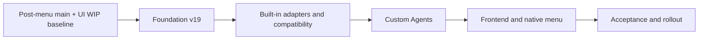

# Agent Provider Switching Program Implementation Plan

> **For agentic workers:** REQUIRED SUB-SKILL: Use superpowers:subagent-driven-development (recommended) or superpowers:executing-plans to implement this plan task-by-task. Steps use checkbox (`- [ ]`) syntax for tracking.

**Goal:** Deliver verified per-Agent Provider switching for the five built-in Agents and declarative Custom Agents while retaining every existing usage, Provider, Profile, proxy, Settings, and menu-bar capability.

**Architecture:** A binding-centric `AgentSwitchService` becomes the sole authority that can publish one verified current binding for an Agent. Installation-local adapters inspect and transactionally rewrite live Agent configuration through protected snapshots, compare-and-swap state, startup recovery, and dynamic proxy audiences; logical Agent/Provider/binding metadata remains syncable while live ownership and recovery state remain local.

**Tech Stack:** Tauri 2.11.5, Rust 2021, rusqlite/SQLite, protected macOS credential storage, XChaCha20-Poly1305, Axum/Hyper proxying, React 18, TypeScript, TanStack Query, Tailwind, i18next, Vitest, Testing Library.

**Approved design:** [`docs/superpowers/specs/2026-07-16-agent-provider-switching-design.md`](../specs/2026-07-16-agent-provider-switching-design.md)

---

## Version-Number Addendum

The approved design names its additive migration “Version 18.” The concurrently implemented menu-bar usage feature already owns physical schema v18 through `usage_providers.daily_budget_usd`. This program therefore implements the same approved behavior as **physical schema v19** after the menu-bar branch is merged. This is a numbering-only correction: no invariant, table, field, migration behavior, or acceptance requirement from the design is removed.

Implementation must fail review if it:

- branches from a pre-menu-bar baseline and claims physical v18;
- renumbers or folds the menu-bar budget migration into this feature;
- edits an existing v18 database without a standalone v18→v19 transaction and completeness validator; or
- changes the logical meaning of “pre-version-18 evidence” in the design. In code and UI that historical category becomes the explicit provenance value `legacy_unscoped`; comments may say “pre-account-provenance” to avoid confusing logical history with the physical schema number.

## Plan Suite and Dependency Graph

Execute the child plans in this exact order. A later plan may start only after all earlier plan gates are committed and green in the isolated feature worktree.

1. [`2026-07-16-agent-provider-switching-foundation.md`](2026-07-16-agent-provider-switching-foundation.md)
   - physical schema v19;
   - switch state, account identity/claims, source epochs, route namespaces;
   - ownership/lock, preview, encrypted journal, recovery, sync/restore guards;
   - secret-safe DTO contracts and mutation guards.
2. [`2026-07-16-agent-provider-switching-built-in-adapters.md`](2026-07-16-agent-provider-switching-built-in-adapters.md)
   - coordinator orchestration and projection;
   - Codex, Claude Code, OpenCode, OpenClaw, and Hermes adapters;
   - official bridges, proxy lifecycle, source attribution;
   - linked legacy Provider/Profile/takeover/native-menu backend behavior.
3. [`2026-07-16-agent-provider-switching-custom-agents.md`](2026-07-16-agent-provider-switching-custom-agents.md)
   - Custom Agent drafts and validated adapter persistence;
   - path/file safety and JSON/TOML/YAML/dotenv editors;
   - dynamic route audience and Custom Provider split-credential upgrade;
   - guarded adapter edit, Disconnect, and deletion.
4. [`2026-07-16-agent-provider-switching-frontend-native.md`](2026-07-16-agent-provider-switching-frontend-native.md)
   - TypeScript contract and query layer;
   - dashboard current-Provider controller;
   - Agents/Providers Settings, adapter wizard, sync review queue;
   - right-click native quick switch while retaining the usage-only left-click popover.
5. [`2026-07-16-agent-provider-switching-acceptance-rollout.md`](2026-07-16-agent-provider-switching-acceptance-rollout.md)
   - failure injection and crash recovery;
   - the parameterized Custom Agent first-release gate;
   - built-in/legacy/Profile/native-menu regression matrix;
   - security scans, whole-repository gates, and release audit.



## Global Non-Negotiable Invariants

- Agent navigation, sorting, visibility, usage refresh, quota refresh, and background observation never initiate a switch.
- A binding may be Bound and Available without being Current. Only an exact verified live selection may be Current.
- Every managed Agent has one permanent switch-state row. Only `config_state = 'in_sync'` may have a non-null `current_binding_id`.
- `last_verified_binding_id` is explanatory only. It never grants “In use,” permits mutation, or repairs current state by itself.
- `config_state` and `route_health` are independent. An in-sync selection may remain current while its route is unhealthy; there is no automatic fallback.
- `AgentSwitchService` is the only writer allowed to commit current binding. Legacy Provider, Profile, takeover, adapter edit, proxy-origin, credential, sync, and restore paths must enter the same guards and locks.
- API-mode Agent configuration receives only a binding-local `lub_*` credential. The Provider-scoped upstream credential never enters Agent files, previews, DTOs, logs, journals, or renderer state.
- Official mode never reads, copies, previews, snapshots, or exports a client-owned OAuth token file. Codex and Claude use dedicated opaque bridges.
- Proxy authorization freezes Agent, Provider, account instance, and account claim before upstream I/O. A local key is rejected under another Agent audience with zero upstream attempts.
- One Provider row represents one upstream billing account. Account identity is immutable; a proof mismatch or unavailable proof creates a separate Provider/account instance instead of merging.
- Historical events, quota observations, and session attribution are immutable. A switch does not relabel old evidence, and records inside an unproven source transition gap remain unassigned.
- Every switch-sensitive write uses compare-and-swap versions, a short-lived server-bound preview token, stable target locks, exact verification, and recoverable transaction phases.
- Byte-exact before-images are encrypted, installation-bound recovery material. They are excluded from normal backup, export, sync, diagnostics, and logs.
- Custom adapter definitions are declarative data. No shell, script, template execution, environment expansion, or command substitution is accepted.
- Machine-local state from another installation is quarantined and never executed. Restore clears verified current state and requires local read-only detection.
- Left-click tray popover remains usage-only. Only the existing native right-click Provider/Profile surface may initiate a quick switch, and only from a fresh backend preview.
- A successful built-in-only implementation is incomplete. The parameterized Custom Agent acceptance gate is mandatory.

## Shared Domain Contract

All child plans use these stable values. A worker must update this master plan and every dependent child plan in one documentation commit before renaming them.

```rust
#[derive(Debug, Clone, Copy, PartialEq, Eq, Serialize, Deserialize)]
#[serde(rename_all = "snake_case")]
pub enum AgentConfigState {
    InSync,
    Drifted,
    Missing,
    SetupRequired,
    Unmanaged,
    Partial,
}

#[derive(Debug, Clone, Copy, PartialEq, Eq, Serialize, Deserialize)]
#[serde(rename_all = "snake_case")]
pub enum AgentRouteHealth {
    Usable,
    Unknown,
    ProxyDown,
    AuthMissing,
    CredentialUnavailable,
    UpstreamUnhealthy,
}

#[derive(Debug, Clone, Copy, PartialEq, Eq, Serialize, Deserialize)]
#[serde(rename_all = "snake_case")]
pub enum SwitchabilityState {
    Ready,
    ConfirmationRequired,
    Blocked,
}

#[derive(Debug, Clone, Copy, PartialEq, Eq, Serialize, Deserialize)]
#[serde(rename_all = "snake_case")]
pub enum BindingCredentialMode {
    Official,
    ProviderSplit,
    LegacyCombined,
}

#[derive(Debug, Clone, PartialEq, Eq, Serialize, Deserialize)]
#[serde(rename_all = "camelCase")]
pub struct EvaluatedSwitchVersions {
    pub switch_state_version: u64,
    pub adapter_version: u64,
    pub binding_switch_config_version: u64,
    pub local_credential_version: u64,
    pub upstream_credential_version: u64,
    pub route_generation: u64,
}

#[derive(Debug, Clone, PartialEq, Eq, Serialize, Deserialize)]
#[serde(rename_all = "camelCase")]
pub struct BindingSwitchability {
    pub state: SwitchabilityState,
    pub reason_codes: Vec<SwitchabilityReasonCode>,
    pub primary_repair_action: SwitchRepairAction,
    pub versions: EvaluatedSwitchVersions,
}
```

Stable reason-code order is recovery/safety, ownership, adapter/protocol/account migration, enabled/credential/login/model, then runtime readiness:

```text
recovery_partial
ownership_conflict
drift_preview
target_creation
takeover_transition
batch_preview
adapter_setup_required
adapter_invalid
protocol_incompatible
account_claim_conflict
legacy_upgrade_required
provider_disabled
binding_disabled
credential_missing
login_missing
model_missing
official_bridge_unsupported
proxy_unavailable
upstream_unhealthy
```

Stable repair actions are:

```text
switch, reapply, preview_switch, view_diagnostics, resolve_ownership,
setup_adapter, edit_adapter, create_separate_account, upgrade_legacy,
enable_provider, enable_binding, set_credential, login, edit_model,
restart_proxy, test_connection
```

The backend authors this object. Frontend code must not reconstruct readiness from enabled, credential, model, adapter, or health fields.

Switch input/output types use the same names in Rust and TypeScript mirrors:

```rust
#[derive(Debug, Clone, PartialEq, Eq, Serialize, Deserialize)]
#[serde(rename_all = "camelCase", deny_unknown_fields)]
pub struct AgentBindingSwitchPreviewInput {
    pub agent_module_id: String,
    pub binding_id: String,
    pub expected_switch_state_version: u64,
    pub expected_adapter_version: u64,
}

#[derive(Debug, Clone, PartialEq, Eq, Serialize, Deserialize)]
#[serde(rename_all = "camelCase", deny_unknown_fields)]
pub struct AgentBindingSwitchInput {
    pub agent_module_id: String,
    pub binding_id: String,
    pub expected_switch_state_version: u64,
    pub expected_adapter_version: u64,
    pub preview_token: String,
}
```

`AgentBindingSwitchPreview` contains the opaque token, expiry, redacted differences, confirmation reasons, intended Provider/model labels, and `EvaluatedSwitchVersions`. `AgentBindingSwitchResult` contains the freshly verified `AgentSwitchView`, stable outcome/recovery code, and redacted message. Neither contains configured bytes, direct hashes, target identities, credentials, credential slots, proof sources, or recovery material.

## Shared Command Contract

The final backend command surface is grouped under `src-tauri/src/commands/agent_switch.rs` and `src-tauri/src/commands/custom_agent_adapter.rs`. Existing usage-dashboard commands remain compatibility entries for Agent/Provider CRUD, but all switch-sensitive mutations call guards owned by `AgentSwitchService`.

```rust
pub async fn get_agent_switch_view(
    state: State<'_, AppState>,
    agent_module_id: String,
) -> Result<AgentSwitchView, AppError>;

pub async fn preview_agent_binding_switch(
    state: State<'_, AppState>,
    input: AgentBindingSwitchPreviewInput,
) -> Result<AgentBindingSwitchPreview, AppError>;

pub async fn apply_agent_binding_switch(
    state: State<'_, AppState>,
    input: AgentBindingSwitchInput,
) -> Result<AgentBindingSwitchResult, AppError>;

pub async fn refresh_agent_switch_state(
    state: State<'_, AppState>,
    agent_module_id: String,
) -> Result<AgentSwitchStateView, AppError>;

pub async fn inspect_guarded_provider_mutation(
    state: State<'_, AppState>,
    input: GuardedMutationInput,
) -> Result<GuardedMutationView, AppError>;
```

`AgentBindingSwitchInput` carries only IDs, expected versions, and the opaque single-use preview token. No apply command accepts a base URL, model projection, local key, upstream key, target bytes, path digest, or claimed switchability from the renderer.

## Shared Test Isolation Contract

- Writer, detector, bridge, recovery, source-import, and end-to-end tests set a temporary HOME before resolving paths.
- Tests use a temporary database, temporary recovery root, in-memory credential store, deterministic clock/ID source where ordering is asserted, and mock upstream.
- No automated test launches the desktop application against the developer's real home, configuration, Keychain entries, or application data.
- Rust commands run only through `pnpm rust -- ...`.
- Focused Vitest commands use `pnpm test:unit <path>` without an inserted `--`.
- Repository-wide Vitest excludes sibling worktrees: `pnpm test:unit --exclude '.worktrees/**'`.
- `pnpm cargo:cache -- status` runs before deleting any implementation worktree.

## Execution Preflight

### Task 0: Establish the only supported baseline

**Files:** none.

- [ ] **Step 1: Inventory all worktrees and local edits**

```bash
git status --short
git worktree list --porcelain
git branch --no-merged main
git log --oneline --decorate -12 main
```

Expected at planning time: the root contains eight unrelated renderer test/component edits plus `.pnpm-store/`; `codex/menu-bar-usage-popover` is an unmerged worktree with renderer work in progress. Do not stash, reset, stage, format, or move either owner's files.

- [ ] **Step 2: Require the menu-bar branch to complete and merge**

Verify its physical v18 migration and left-click popover tests are committed and merged to `main`:

```bash
git branch --contains codex/menu-bar-usage-popover
git log --oneline main -- src-tauri/src/usage/budget_migration.rs
rg -n 'SCHEMA_VERSION: i32 = 18|daily_budget_usd' src-tauri/src/database/mod.rs src-tauri/src/usage/budget_migration.rs
pnpm rust -- test --manifest-path src-tauri/Cargo.toml usage::budget_migration --lib
pnpm test:unit src/components/tray-usage/TrayUsagePopover.test.tsx
```

Expected: `main` contains the menu branch; schema is exactly v18; left-click popover is green. If the branch is not merged, stop this program and finish that work first.

- [ ] **Step 3: Resolve the root renderer WIP as a separate baseline decision**

The current Settings sorter/close/navigation edits overlap files required by this feature. Their owner must either commit and merge them to `main`, or explicitly decide to exclude them. This program must never absorb them accidentally.

```bash
git diff --name-only
git diff --check
git log --oneline main -- \
  src/components/settings/DashboardModulesSettings.tsx \
  src/components/settings/SettingsPage.tsx \
  src/components/usage-dashboard/DashboardModuleSwitcher.tsx
```

Expected: the chosen baseline is represented by commits on `main`; the feature worktree starts clean. Record the decision in the implementation task log before continuing.

- [ ] **Step 4: Create a clean isolated implementation worktree**

Read `superpowers:using-git-worktrees`, then create the worktree from the resulting `main`:

```bash
git rev-parse main
git worktree add .worktrees/agent-provider-switching -b codex/agent-provider-switching main
git -C .worktrees/agent-provider-switching status --short
git -C .worktrees/agent-provider-switching rev-parse --abbrev-ref HEAD
```

Expected: branch `codex/agent-provider-switching`, empty status, and a base commit that contains menu-bar v18 plus the explicit renderer-WIP decision.

- [ ] **Step 5: Capture the baseline gates inside the isolated worktree**

```bash
pnpm install --offline
pnpm rust -- test --manifest-path src-tauri/Cargo.toml --lib
pnpm test:unit --exclude '.worktrees/**'
pnpm typecheck
pnpm build
```

Expected: all commands pass before a feature edit. If a pre-existing failure remains, record the exact command/output and obtain an explicit decision before changing production code.

- [ ] **Step 6: Commit only a preflight note if the baseline required a recorded exception**

Normally this task produces no commit. If an approved exception exists, record it at the fixed path below and commit only that note:

```bash
git add docs/superpowers/progress/2026-07-16-agent-provider-switching-baseline.md
git diff --cached --check
git commit -m "docs: record agent switching baseline"
```

## Program-Level Review Gates

- [ ] **Gate 1: Foundation** — schema v19 migrates atomically; current state, account provenance, dynamic audiences, epochs, preview/journal/recovery, local-only sync/restore behavior, and mutation guards pass focused tests.
- [ ] **Gate 2: Built-ins** — five adapters switch the actual selector/model while preserving unrelated data; official bridges, proxy lifecycle, source gaps, linked legacy, Profile/takeover coordination, and detector adoption pass.
- [ ] **Gate 3: Custom Agents** — drafts, safe paths, four format subsets, multi-file atomicity, dynamic routes, split credentials, Disconnect, and Custom Provider upgrade pass.
- [ ] **Gate 4: Renderer/native** — dashboard, Settings, wizard, guards, sync queue, right-click quick switch, main-window confirmation fallback, and left-click usage-only regression tests pass.
- [ ] **Gate 5: Release** — parameterized Custom Agent acceptance, built-in parity, crash/failpoint matrix, secret sentinel scan, full Rust/Vitest/type/build gates, and manual macOS smoke all pass.

## Commit Discipline

- Use the exact task commits listed in each child plan; one commit should establish one reviewable invariant.
- Never combine schema, cryptography, OS file-safety, frontend presentation, or dependency changes into one undifferentiated commit.
- Before every commit run `git diff --check`, inspect `git diff --stat`, and read the complete patch in order.
- Do not stage `.pnpm-store/`, root-worktree WIP, generated logs, test HOME data, recovery blobs, credentials, screenshots containing account data, or unrelated menu-bar changes.
- Kimi is prohibited for architecture, schema, security, authentication/authorization, protected credentials, recovery, OS file safety, dependency changes, and native lifecycle work. After backend DTOs are stable, a child plan may mark bounded renderer-only tasks as Kimi-eligible; call `kimi_delegation_status` first, read the full proposed patch, obtain its review token, apply, retest in the real worktree, then accept or rollback exactly as `AGENTS.md` requires.

## Completion Rule

Do not mark this program complete when the UI renders, when one built-in Agent switches, or when unit tests alone pass. Completion requires every child plan checkbox and Gate 5, one final clean working tree, and a completion audit that maps each approved-design acceptance item to passing evidence.
